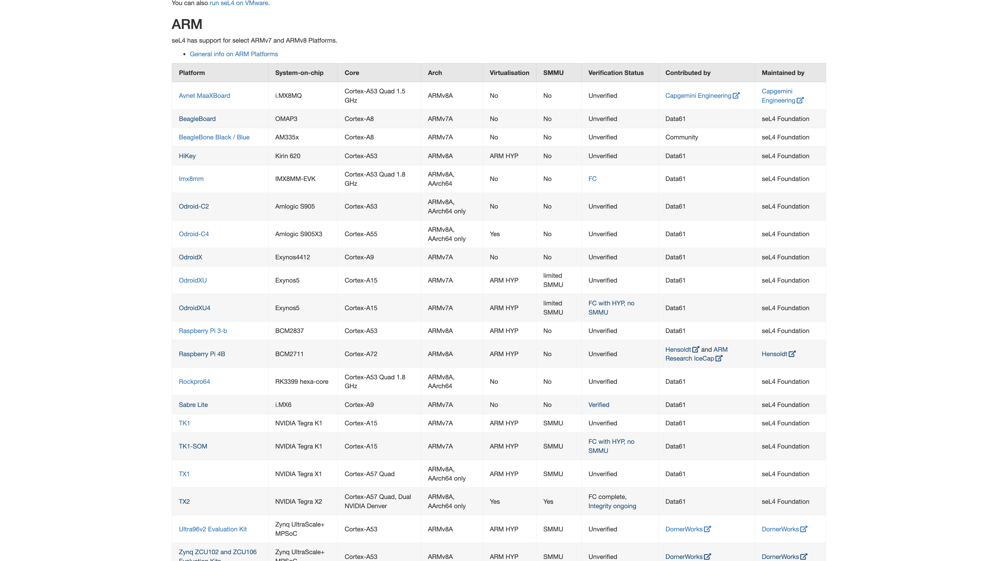

# Compatible Hardware for seL4

## Popular Boards in Each Architecture

1. **TX2 - Nvidia's Module**: [Nvidia Jetson TX2 NX 4GB Module](https://robu.in/product/nvidia-jetson-tx2-nx-4gb-module/)
2. **BeagleBoard**: [BeagleBone Black](https://www.amazon.in/Beaglebone-Black-Devkit-BeagleBone-Rev/dp/B00K7EEX2U)
3. **HiFive Unleashed**: [HiFive Unleashed](https://www.sifive.com/boards/hifive-unleashed)

## Why Drop RISC-V?

1. **Maturity**: ARM and x86 are highly mature and proven architectures with comprehensive support for seL4, making them a safer and more reliable choice for many projects, especially in production environments.
2. **Availability**: ARM and x86 architectures have a wide variety of hardware options readily available, from development boards to industrial-grade processors, while RISC-V hardware is still emerging.
3. **Performance**: ARM and x86 outperform RISC-V in many areas such as real-time capabilities, energy efficiency, and overall performance optimizations, which are critical for many embedded systems or high-performance applications.
4. **Support and Ecosystem**: Both ARM and x86 have robust ecosystems with strong communities, toolchains, documentation, and industry-wide adoption, reducing risks and making development faster and more predictable.

For these reasons, RISC-V might not be the best choice for many projects using seL4, especially those that require mature support, production-grade hardware, and established ecosystems.

## Why Drop x86?

1. **Energy Efficiency**: ARM’s power-efficient design is better suited for low-power embedded and IoT applications, whereas x86 is more power-hungry and less optimal for battery-operated devices.
2. **Real-Time and Embedded Focus**: ARM’s real-time processing capabilities and focus on embedded systems make it a better choice for seL4, which often targets real-time, safety-critical applications.
3. **Smaller, Cheaper, and More Integrated**: ARM processors tend to be more compact, less expensive, and more integrated into SoCs, which makes them better suited for embedded systems and IoT devices.
4. **Security and Flexibility**: ARM’s security features like TrustZone and its customizable architecture make it a more suitable choice for modern secure embedded systems compared to x86.
5. **Ecosystem and Tooling**: ARM’s ecosystem is more robust for embedded development, with better tools, vendor support, and a large community.

## Choosing ARM Architecture

ARM is ideal for seL4 due to its low power consumption, high performance efficiency, wide industry adoption (particularly in mobile and embedded systems), and strong support for virtualization and security features like TrustZone. ARM's architecture aligns well with seL4's design goals of safety, security, and real-time performance, making it the preferred choice for many embedded and IoT applications.

## Final Options

- **NVIDIA Jetson**: Ideal for AI and robotics with a powerful GPU.
- **BeagleBone Black**: Known for real-time performance and flexibility.

### Choosing BeagleBone Black for Real-Time Performance - https://www.beagleboard.org/boards/beaglebone-black 
